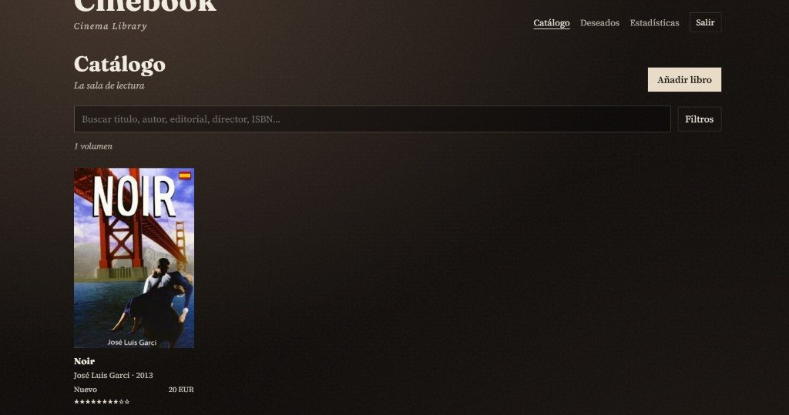
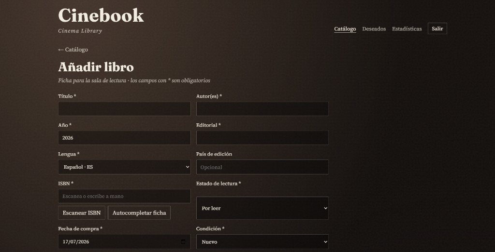
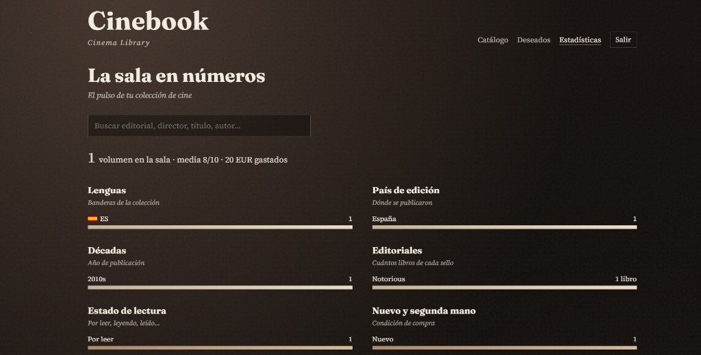
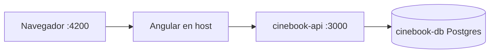

# Cinebook — Cinema Library

Catálogo personal de **libros de cine**: inventario claro, anti-duplicados, lista de deseados y estadísticas.  
Marca: **Cinebook** · subtexto **Cinema Library**.

**Repositorio:** [github.com/Sarajesko/Cinebook](https://github.com/Sarajesko/Cinebook)

---

## Índice

1. [¿Para qué sirve?](#para-qué-sirve)
2. [Qué incluye](#qué-incluye)
3. [Capturas](#capturas)
4. [Estructura](#estructura-del-monorepo)
5. [Requisitos](#requisitos)
6. [Arranque rápido (elige un modo)](#arranque-rápido-elige-un-modo)
7. [Modo A — Local con SQLite](#modo-a--local-con-sqlite-npm)
8. [Modo B — Docker Compose (Postgres + API)](#modo-b--docker-compose-postgres--api)
9. [Uso de la aplicación](#uso-de-la-aplicación)
10. [Rutas del front](#rutas-del-front)
11. [API REST](#api-rest)
12. [Ejemplos curl](#ejemplos-curl)
13. [Tests](#tests)
14. [Stack y arquitectura](#stack-y-arquitectura)
15. [Solución de problemas](#solución-de-problemas)
16. [Roadmap](#roadmap)
17. [Licencia](#licencia)

---

## ¿Para qué sirve?

Evitar comprar el mismo libro dos veces y tener a mano, en una sola app:

- qué ediciones tienes (lengua, país, ISBN, nuevo / segunda mano, precio, puntuación);
- qué títulos estás buscando (wishlist);
- cómo está compuesta tu colección (estadísticas).

La interfaz sigue la metáfora de una **sala de lectura de cine** (atmósfera editorial), no de una estantería genérica de DVDs.

---

## Qué incluye

| Área | Estado |
|------|--------|
| API NestJS (auth JWT, libros, wishlist, stats, anti-duplicado, ISBN lookup) | Listo |
| Front Angular: login, catálogo, ficha, alta / edición | Listo |
| Filtros y búsqueda (título, editorial, directores, ISBN…) | Listo |
| Escaneo ISBN por cámara (con fallback manual) | Listo |
| Autocompletado de ficha / carátula (Google Books → Open Library → Bookcover) | Listo |
| Wishlist UI + «Ya lo tengo» → colección | Listo |
| Estadísticas «La sala en números» (periodos, buscador, editoriales) | Listo |
| Favicon + banderas SVG (incl. catalán) | Listo |
| Docker Compose (PostgreSQL + API Nest) | Listo (front en el host) |
| CI GitHub Actions (tests en push/PR) | Listo |

### Modelo de libro

**Obligatorios:** título, autores, año, editorial, **lengua** (`es` / `ca` / `en` / `fr` / `pt` → códigos **ES**, **CAT**, **US/UK**, **FR**, **PT**), **ISBN**, estado de lectura, fecha de compra (se muestra como «hace X»), condición (**nuevo** / **segunda mano**).

**Opcionales:** país de edición, **precio** y moneda, **puntuación 1–10**, carátula (URL), notas, dónde comprado, figuras del cine (**directores**, **directores de fotografía**, **banda sonora**, guionistas, actores, productores).

El autocompletado por ISBN rellena título, autores, año, editorial, lengua, carátula y, si hay lengua clara, sugiere país.

### Modelo de deseado (wishlist)

Campos ligeros: título (obligatorio), autores, ISBN, lengua (mismas opciones), país, notas, prioridad (`alta` / `media` / `baja`).

---

## Capturas

| Catálogo | Alta de libro | Estadísticas |
|----------|---------------|--------------|
|  |  |  |

---

## Estructura del monorepo

```
Cinebook/
├── frontend/                 Angular 19 — View (UI)
├── backend/                  NestJS 11 + Prisma — Controller / Model
│   ├── Dockerfile            Imagen de la API (PostgreSQL)
│   ├── docker-entrypoint.sh  Espera DB + prisma db push + arranque
│   └── prisma/               Schema (SQLite en local; PG en la imagen)
├── docs/screenshots/         Capturas reales de la UI
├── .github/workflows/        CI (tests)
├── docker-compose.yml        Servicios db + api
├── .env.example              Variables de Compose (copiar a `.env`)
├── .gitattributes            Scripts .sh con fin de línea LF
├── LICENSE                   MIT
└── README.md
```

| Carpeta / archivo | Rol |
|-------------------|-----|
| `frontend/` | View Angular |
| `backend/` | Controller Nest + Model Prisma |
| `docs/screenshots/` | Capturas de la aplicación |
| `docker-compose.yml` | Postgres 16 + API en contenedores |
| `.env.example` | Plantilla de secretos/puertos para Compose |

---

## Requisitos

| Herramienta | Para qué |
|-------------|----------|
| **Node.js 22+** y **npm 11+** | Front siempre; API en modo local |
| **Docker Desktop** (o Docker Engine + Compose v2) | Modo B (Postgres + API) |
| Navegador moderno | Chrome / Edge / Firefox / Safari |
| Cámara (opcional) | Escaneo ISBN; si falla → entrada manual |

---

## Arranque rápido (elige un modo)

| Modo | Base de datos | API | Front |
|------|---------------|-----|-------|
| **A — Local** | SQLite (`file:./dev.db`) | `npm run start:dev` en `backend/` | `npm start` en `frontend/` |
| **B — Docker** | PostgreSQL (contenedor) | Contenedor Nest | `npm start` en `frontend/` (host) |

Ambos modos sirven el mismo contrato REST bajo `/api`. El front llama por defecto a `http://localhost:3000/api`.

---

## Modo A — Local con SQLite (npm)

Ideal para desarrollar y pasar tests sin Docker.

### 1. API

```bash
cd backend
cp .env.example .env
npm install
npx prisma migrate dev
npm run start:dev
```

| Recurso | Valor |
|---------|--------|
| API | [http://localhost:3000/api](http://localhost:3000/api) |
| Health | `GET /api` → `Cinebook API — Cinema Library` |
| DB | SQLite (`DATABASE_URL="file:./dev.db"`) |

Ejemplo `backend/.env`:

```env
PORT=3000
CORS_ORIGIN=http://localhost:4200
JWT_SECRET=cambia-este-secreto-en-local
JWT_EXPIRES_IN=7d
DATABASE_URL="file:./dev.db"
```

### 2. Front

```bash
cd frontend
npm install
npm start
```

| Recurso | Valor |
|---------|--------|
| App | [http://localhost:4200](http://localhost:4200) |
| API | `http://localhost:3000/api` → [`frontend/src/environments/environment.ts`](frontend/src/environments/environment.ts) |

---

## Modo B — Docker Compose (Postgres + API)

El front Angular **sigue en el host**. Compose solo levanta **PostgreSQL** y la **API Nest**.

### Qué hace Compose



- Al arrancar la API: espera a Postgres → `prisma db push` → `node dist/src/main.js`.
- Los datos de Postgres viven en el volumen Docker `cinebook_pgdata`.
- En la **imagen** el schema Prisma se genera para **PostgreSQL**; en **local npm** sigue siendo **SQLite**.

### 1. Variables

En la **raíz** del monorepo:

```bash
cp .env.example .env
```

Edita al menos `JWT_SECRET`. Variables principales:

| Variable | Default | Descripción |
|----------|---------|-------------|
| `POSTGRES_USER` | `cinebook` | Usuario Postgres |
| `POSTGRES_PASSWORD` | `cinebook` | Contraseña |
| `POSTGRES_DB` | `cinebook` | Nombre de la base |
| `POSTGRES_PORT` | `5433` | Puerto en el **host** → 5432 del contenedor |
| `API_PORT` | `3000` | Puerto en el **host** → 3000 del contenedor |
| `JWT_SECRET` | (ejemplo) | Secreto JWT — **cámbialo** |
| `JWT_EXPIRES_IN` | `7d` | Caducidad del token |
| `CORS_ORIGIN` | `http://localhost:4200` | Origen permitido del front |

`POSTGRES_PORT` por defecto es **5433** para no chocar con un Postgres local en 5432.

### 2. Levantar

```bash
docker compose up --build
# o en segundo plano:
docker compose up --build -d
```

| Servicio | Contenedor | URL típica |
|----------|------------|------------|
| API | `cinebook-api` | [http://localhost:3000/api](http://localhost:3000/api) |
| Postgres | `cinebook-db` | `localhost:5433` (user/pass/db: `cinebook`) |

Comprobar salud:

```bash
curl http://localhost:3000/api
# → Cinebook API — Cinema Library

docker compose ps
docker compose logs -f api
```

### 3. Front contra la API en Docker

```bash
cd frontend
npm install
npm start
```

Abre [http://localhost:4200](http://localhost:4200).

Si tuviste que poner `API_PORT=3001` (puerto 3000 ocupado), o bien:

- libera el 3000 y usa el default, **o**
- cambia temporalmente `apiUrl` en [`frontend/src/environments/environment.ts`](frontend/src/environments/environment.ts) a `http://localhost:3001/api`.

### 4. Parar / limpiar

```bash
docker compose down          # para contenedores; conserva datos
docker compose down -v       # además borra el volumen Postgres
docker compose build --no-cache api   # rebuild limpio de la API
```

### Archivos Docker relevantes

| Archivo | Función |
|---------|---------|
| [`docker-compose.yml`](docker-compose.yml) | Servicios `db` + `api`, healthcheck, volumen |
| [`backend/Dockerfile`](backend/Dockerfile) | Build multi-stage Node 22 |
| [`backend/docker-entrypoint.sh`](backend/docker-entrypoint.sh) | Espera DB + `prisma db push` + arranque |
| [`.env.example`](.env.example) | Plantilla de entorno Compose |

---

## Uso de la aplicación

1. **Registro / login** — `/registro` o `/login` (handle + contraseña).
2. **Catálogo** — `/catalogo`: grid de carátulas con bandera de lengua, condición, precio y estrellas.
3. **Búsqueda y filtros** — texto libre (título, autor, ISBN, figuras) + filtros por lengua, país, estado, condición, puntuación, año, autor, editorial, director, guionista, actor, productor. Los filtros van en la URL.
4. **Alta / edición** — `/catalogo/nuevo` o `/catalogo/:id/editar`. Campos con `*` obligatorios. **Escanear ISBN** abre la cámara y dispara anti-duplicado.
5. **Anti-duplicado** — aviso no bloqueante («¿Ya tienes este?») por ISBN o por título + autor + editorial. Puedes guardar igualmente.
6. **Deseados** — `/deseados`: lo que buscas. **Ya lo tengo** pasa el título a colección (`recien_comprado`) y cierra el deseo.
7. **Estadísticas** — `/estadisticas`: «La sala en números» (lenguas, país, década, editorial, estado, condición, gasto, puntuaciones, crecimiento, figuras, wishlist).

---

## Rutas del front

| Ruta | Descripción | Guard |
|------|-------------|--------|
| `/login` · `/registro` | Auth | guest |
| `/catalogo` | Grid + filtros / búsqueda | auth |
| `/catalogo/nuevo` · `/catalogo/:id/editar` | Alta / edición (+ escaneo ISBN) | auth |
| `/catalogo/:id` | Ficha del libro | auth |
| `/deseados` | Lista de deseados | auth |
| `/deseados/nuevo` · `/deseados/:id/editar` | Alta / edición de deseado | auth |
| `/deseados/:id/conseguir` | Ya lo tengo → colección | auth |
| `/estadisticas` | La sala en números | auth |

Nav autenticada: **Catálogo** · **Deseados** · **Estadísticas** · Salir.

---

## API REST

Prefijo global: `/api`.  
Auth: header `Authorization: Bearer <accessToken>`.

### Auth

| Método | Ruta | Auth | Body / notas |
|--------|------|------|----------------|
| POST | `/auth/register` | no | `{ "handle", "password" }` |
| POST | `/auth/login` | no | `{ "handle", "password" }` → `{ accessToken, … }` |
| GET | `/auth/me` | sí | Usuario actual |

### Libros

| Método | Ruta | Auth | Notas |
|--------|------|------|--------|
| GET | `/books` | sí | Listado del usuario |
| POST | `/books` | sí | Alta; puede devolver `wishMatch` |
| POST | `/books/check-duplicate` | sí | Aviso no bloqueante |
| GET | `/books/:id` | sí | Ficha |
| PATCH | `/books/:id` | sí | Edición parcial |
| DELETE | `/books/:id` | sí | Borrado |

**Alta — obligatorios:** `titulo`, `autores`, `anio`, `editorial`, `lengua` (`es` \| `en` \| `fr` \| `pt`), `paisEdicion`, `isbn`, `estado` (`por_leer` \| `leyendo` \| `leido` \| `recien_comprado`), `fechaCompra` (ISO date), `condicion` (`nuevo` \| `segunda_mano`), `precio`, `puntuacion` (1–10).

**Opcionales:** `caratula`, `notas`, `dondeComprado`, `directores[]`, `guionistas[]`, `actores[]`, `productores[]`, `moneda` (default `EUR`).

La respuesta añade `bandera` (`ES` / `USA` / `FR` / `PT`) y `haceCuanto`. ISBN duplicado en colección → **409**; el aviso previo va por `check-duplicate`.

### Wishlist

| Método | Ruta | Auth | Notas |
|--------|------|------|--------|
| GET | `/wishes` | sí | Listado |
| POST | `/wishes` | sí | Alta |
| GET / PATCH / DELETE | `/wishes/:id` | sí | Lectura / edición / borrado |
| POST | `/wishes/:id/to-collection` | sí | Body = ficha de libro; crea libro y cierra el deseo |

### Estadísticas

| Método | Ruta | Auth | Notas |
|--------|------|------|--------|
| GET | `/stats` | sí | Overview de la colección + wishlist abiertos |

---

## Ejemplos curl

Sustituye el puerto si usas `API_PORT=3001`.

```bash
# Health
curl -s http://localhost:3000/api

# Registro
curl -s -X POST http://localhost:3000/api/auth/register \
  -H "Content-Type: application/json" \
  -d "{\"handle\":\"cinefilo\",\"password\":\"secreto1\"}"

# Login → copiar accessToken
curl -s -X POST http://localhost:3000/api/auth/login \
  -H "Content-Type: application/json" \
  -d "{\"handle\":\"cinefilo\",\"password\":\"secreto1\"}"

# Listar libros
curl -s http://localhost:3000/api/books \
  -H "Authorization: Bearer TOKEN"

# Anti-duplicado por ISBN
curl -s -X POST http://localhost:3000/api/books/check-duplicate \
  -H "Authorization: Bearer TOKEN" \
  -H "Content-Type: application/json" \
  -d "{\"isbn\":\"9780306406157\"}"

# Estadísticas
curl -s http://localhost:3000/api/stats \
  -H "Authorization: Bearer TOKEN"
```

---

## Tests

```bash
# Backend — unitarios
cd backend && npm test

# Backend — e2e (flujo crítico: login → alta → anti-duplicado → búsqueda → wishlist)
cd backend && npm run test:e2e

# Frontend — unitarios (Chrome headless)
cd frontend && npm run test:ci
```

| Suite | Comando | Contenido |
|-------|---------|-----------|
| Backend unit | `npm test` | Auth, books, wishes, stats, ISBN lookup |
| Backend e2e | `npm run test:e2e` | HTTP real + flujo crítico |
| Frontend | `npm run test:ci` | Componentes, filtros, ISBN, wishlist, stats |

Los tests del backend usan **SQLite** (modo local), no el Postgres de Compose.

En cada push/PR a `main`, GitHub Actions ejecuta las suites unitarias (backend + front) y los e2e del backend (`.github/workflows/ci.yml`).

---

## Stack y arquitectura

| Capa | Tecnología |
|------|------------|
| View | Angular 19 + SCSS · Fraunces / Source Serif 4 · ZXing (ISBN) |
| Controller | NestJS 11 · JWT (Passport) · ValidationPipe |
| Model | Prisma 7 · SQLite local (`better-sqlite3`) · PostgreSQL en Docker (`@prisma/adapter-pg` + `pg`) |

Arquitectura **MVC**: Model (Prisma) · Controller (Nest REST) · View (Angular).

El servicio Prisma elige adaptador según `DATABASE_URL` (`file:…` → SQLite, `postgresql://…` → Postgres).

---

## Solución de problemas

| Problema | Qué revisar |
|----------|-------------|
| Front 401 / no carga datos | API arriba; `environment.apiUrl` coincide con el puerto real (`3000` o `API_PORT`) |
| `Bind … 3000` / `5432` already allocated | En `.env`: `API_PORT=3001`, `POSTGRES_PORT=5433` (ya es el default de Postgres en Compose) |
| `exec docker-entrypoint.sh: no such file` | Fines de línea CRLF; el Dockerfile hace `sed` a LF; hay `.gitattributes` para `*.sh` |
| API Docker reinicia en bucle | `docker compose logs api`; suele ser DB aún no lista o fallo de `prisma db push` |
| Prisma / migrate en local | `npx prisma migrate dev` con `DATABASE_URL="file:./dev.db"` |
| Escaneo ISBN sin cámara | Permiso del navegador (HTTPS o localhost); escribe el ISBN a mano |
| ISBN 409 | Ya tienes ese ISBN; usa `check-duplicate` o edita el libro existente |
| Tests e2e fallan | Ejecutar solo en `backend/`; no mezclar con otra instancia usando la misma DB de test |

---

## Roadmap

- Publicar demo online (API + front) para probar sin instalar.
- Identificador `SIN-ISBN-…` cuando el código no es legible (segunda mano).
- Contener el front (nginx) en Compose — opcional.
- FastAPI **no** forma parte del camino principal (Nest es la API de Cinebook).

---

## Licencia

[MIT](LICENSE) — software libre: puedes usar, modificar y redistribuir con la atribución correspondiente.
