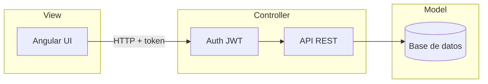

# Cinebook — Contexto del proyecto

Documento de referencia para construir una aplicación de catálogo personal de **libros de cine**: inventario claro, búsqueda rápida y aviso cuando un título ya está en la colección.

---

## 1. Visión

**Cinebook** es una aplicación sencilla y profesional para registrar los libros sobre cine que ya se han comprado. El objetivo principal es **no comprar duplicados** y tener a mano autor, año, editorial, lengua, país de edición, **ISBN** y, siempre que sea posible, la carátula. También debe permitir localizar libros por las figuras del cine de las que tratan: **directores, guionistas, actores y productores**.

La app nace como herramienta personal de un coleccionista cinefilo, con autenticación y flujo de usuario para añadir y gestionar la colección. El diseño del front (Angular) debe sentirse cuidado y cinematográfico, no genérico.

---

## 2. Problema y objetivo

| Problema | Objetivo |
|----------|----------|
| No recordar si un libro ya está en la estantería | Inventario consultable en segundos |
| Ediciones en ES / EN / FR / PT (p. ej. Portugal) | Lengua + país de edición, filtrables |
| Querer todos los libros sobre un director, actor, etc. | Buscar y filtrar por directores, guionistas, actores y productores |
| Fichas incompletas o en papel | Datos estructurados + ISBN + carátulas |
| Riesgo de comprar el mismo título otra vez | Detección / aviso de posibles duplicados (ISBN primero) |

**Éxito de la v1:** poder entrar con login, ver la colección con carátulas, añadir o editar libros, filtrar y buscar por criterios clave (incluidas figuras del cine) y recibir un aviso si el alta parece repetida.

---

## 3. Usuario

- **Perfil:** cinefilo y lector de libros de cine (historia, teoría, directores, géneros, técnicas, etc.).
- **Uso:** autenticado; gestiona su propia colección (alta, edición, consulta).
- **Idiomas de los libros:** español, inglés, francés y portugués (incluye ediciones hechas en Portugal). El idioma de la interfaz de la v1 será español.
- **Edición:** la lengua del texto y el país de edición son independientes (p. ej. libro en portugués editado en Portugal; también ediciones en inglés o francés).

---

## 4. Requisitos funcionales (v1)

1. **Autenticación** — registro/login de usuario; rutas protegidas para gestionar la colección.
2. **CRUD de libros** — crear, listar, ver detalle, editar y eliminar.
3. **Campos obligatorios** — título, autor(es) del libro, año de publicación, editorial, lengua, **ISBN**.
4. **País de edición** — obligatorio; permite distinguir ediciones (p. ej. Portugal) con independencia de la lengua.
5. **Figuras del cine (opcionales, indexables)** — directores, guionistas, actores y productores de los que trata el libro; listas de nombres para filtrar y buscar.
6. **Estado de lectura** — obligatorio; valores: `por_leer`, `leyendo`, `leido`, `recien_comprado`.
7. **Fecha de compra** — obligatoria; la UI muestra también cuánto tiempo hace que se compró (relativo: «hace 3 días», «hace 2 meses»).
8. **Carátula** — URL de imagen o subida de archivo; visible en listado y detalle.
9. **Filtros** — por lengua, país de edición, estado, año, autor del libro, editorial, director, guionista, actor y productor.
10. **Búsqueda** — texto libre sobre título, autor del libro, ISBN, directores, guionistas, actores y productores.
11. **Escaneo de ISBN** — al añadir o editar un libro, poder leer el código de barras (ISBN) con la cámara del dispositivo y rellenar el campo automáticamente.
12. **Lista de deseados (wishlist)** — catálogo paralelo de libros que se buscan; contraste claro con “ya lo tengo”; útil en feria / segunda mano.
13. **Estadísticas** — vista de colección: por lengua, país, década, editorial, estado; crecimiento en el tiempo; diseño cuidado (no un panel genérico).
14. **Anti-duplicado básico** — al guardar, priorizar match por **ISBN**; si no hay coincidencia exacta, comparar título + autor + editorial; mostrar aviso tipo «¿Ya tienes este?» antes de confirmar. Si un ISBN deseado pasa al catálogo, ofrecer quitarlo de la wishlist.

---

## 5. Modelo de datos

### Libro

| Campo | Tipo / notas | Obligatorio |
|-------|----------------|-------------|
| `titulo` | texto | sí |
| `autores` | texto o lista de nombres (autores del libro) | sí |
| `anio` | entero (año de publicación) | sí |
| `editorial` | texto | sí |
| `lengua` | enum: `es`, `en`, `fr`, `pt` | sí |
| `pais_edicion` | país donde se editó (p. ej. Portugal, Francia, Reino Unido, España…) | sí |
| `isbn` | texto (ISBN-10 o ISBN-13); clave principal anti-duplicado | sí |
| `estado` | enum: `por_leer`, `leyendo`, `leido`, `recien_comprado` | sí |
| `fecha_compra` | fecha; base para mostrar «hace X tiempo» | sí |
| `directores` | lista de nombres (de quién trata el libro) | no |
| `guionistas` | lista de nombres | no |
| `actores` | lista de nombres | no |
| `productores` | lista de nombres | no |
| `caratula` | URL o ruta de archivo | no (recomendado) |
| `notas` | texto libre | no |
| `donde_comprado` | texto | no |
| `usuario_id` | relación con el usuario propietario | sí |
| `creado_en` / `actualizado_en` | timestamps | sí (sistema) |

**Nota:** `autores` son quienes escribieron el libro; `directores` / `guionistas` / `actores` / `productores` son las figuras cinematográficas sobre las que versa o a las que se asocia el contenido. Todos estos campos de personas deben ser **buscables y filtrables**.

**Lengua vs país:** `lengua` es el idioma del texto (español, inglés, francés, portugués). `pais_edicion` es dónde se publicó (p. ej. un libro en portugués hecho en Portugal). Ambos son necesarios para no confundir ediciones.

**Estado y compra:** `estado` refleja el ciclo del volumen en la sala (`por_leer`, `leyendo`, `leido`, `recien_comprado`). `fecha_compra` se guarda como fecha concreta; en listado y ficha se muestra también el tiempo relativo («hace 5 días», «hace 1 año»).

### Deseado (wishlist)

| Campo | Tipo / notas | Obligatorio |
|-------|----------------|-------------|
| `titulo` | texto | sí |
| `autores` | texto o lista | no |
| `isbn` | si se conoce | no |
| `lengua` | `es` / `en` / `fr` / `pt` | no |
| `pais_edicion` | si se conoce | no |
| `notas` | p. ej. “buscar en feria” | no |
| `prioridad` | opcional (alta / media / baja) | no |
| `usuario_id` | propietario | sí |
| `creado_en` | timestamp | sí |

Al añadir al catálogo un libro cuyo ISBN (o título+autor) coincida con un deseado, la app propone **pasarlo de wishlist a colección** y cerrar el deseo.

### Usuario

| Campo | Notas |
|-------|--------|
| email / username | identificador de login |
| password_hash | nunca almacenar contraseña en claro |
| fechas de alta | auditoría básica |

---

## 6. Arquitectura MVC

Se adopta **MVC (Model–View–Controller)**:

- **Model** — entidades y persistencia (Usuario, Libro, Deseado) en base de datos.
- **Controller** — API REST que valida, aplica reglas (auth, anti-duplicado) y orquesta el acceso al modelo.
- **View** — aplicación Angular: pantallas de login, listado, ficha y formularios.

Flujo típico: el usuario inicia sesión → recibe token → la UI Angular llama a la API → el controller aplica reglas y lee/escribe el model.

---

## 7. Stack propuesto

| Capa | Tecnología |
|------|------------|
| Front (View) | **Angular** — UI propia, tipografía expresiva, atmósfera de cine; grid de carátulas como ancla visual |
| Back (Controller) | **Node.js + NestJS** — API REST modular, alineada con MVC |
| Base de datos (Model) | **PostgreSQL** en producción; **SQLite** aceptable solo para prototipo local rápido |
| Auth | **JWT** tras login; rutas de API y de Angular protegidas |
| Almacenamiento de carátulas | carpeta/servidor de estáticos o almacenamiento de objetos; en v1 basta URL o upload local |

---

## 8. Alcance de la v1

Incluye:

- Login / sesión de usuario
- Listado en grid con carátulas
- Alta y edición de libros (ISBN, estado, fecha de compra; lengua; país de edición; figuras del cine)
- Filtros por lengua, país de edición, estado, año, autor, editorial, director, guionista, actor y productor
- Búsqueda por título, autor, ISBN y figuras del cine (directores, guionistas, actores, productores)
- Tiempo relativo desde la compra («hace X…») derivado de `fecha_compra`
- Escaneo de ISBN por cámara / código de barras en el alta (y edición)
- **Lista de deseados** (alta, listado, pasar a colección al comprar)
- **Estadísticas** de la colección (lengua, país, década, editorial, estado, crecimiento)
- Anti-duplicado básico priorizando ISBN (aviso, no bloqueo duro obligatorio)
- Detalle de ficha del libro
- Dirección visual v1: **sala de lectura de cine** (revisable más adelante; ver [`ideas.md`](ideas.md))

No incluye (ver [`ideas.md`](ideas.md)):

- Marketplace ni compra online
- OCR de lomos/carátulas
- App móvil nativa
- Red social pública o recomendaciones ML
- Autocompletar metadatos/carátula vía APIs externas (v1.5)

---

## 9. Criterios de calidad

- Interfaz **profesional y cinematográfica**, sin aspecto de plantilla genérica.
- Datos mínimos siempre completos (autor, año, editorial, lengua, país de edición, **ISBN**, estado, fecha de compra).
- Consulta rápida antes de comprar: filtros + búsqueda (libro, ISBN y figuras del cine) + aviso de duplicado.
- Código organizado en capas MVC claras y mantenibles.

---

## 10. Nombre del proyecto

**Cinebook** — nombre oficial de la aplicación.  
**Subtexto / tagline:** Cinema Library.

La dirección de marca visual se detalla en [`ideas.md`](ideas.md).
