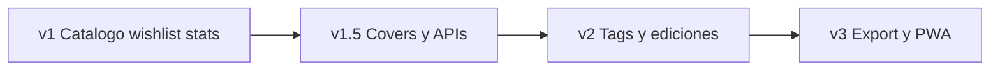

# Cinebook — Ideas

Banco de ideas creativas y de producto. **No son compromisos de la v1**; sirven para inspirar diseño, priorizar el roadmap y mantener el tono profesional y cinefilo del proyecto.

Documento hermano: [`contexto.md`](contexto.md).

---

## 1. Nombre y branding

### Nombre oficial

**Cinebook** — nombre definitivo de la aplicación.  
**Subtexto:** *Cinema Library* (cabecera, landing y about).

Uso en UI: marca hero **Cinebook**; debajo o al lado, el subtexto **Cinema Library** con menos peso tipográfico.

### Variantes de cabecera

| Variante | Uso |
|----------|-----|
| Cinebook | Marca principal (hero) |
| Cinema Library | Subtexto fijo |
| Cinebook — Cinema Library | Bloque completo de marca |

### Dirección visual

- **Atmósfera:** sala a oscuras, luz de proyector, grano sutil; fondos con profundidad (gradientes, textura ligera), no plano de un solo color.
- **Tipografía:** display con carácter de cartel o ficha de cine; evitar Inter / Roboto / Arial como tipografía principal.
- **Ancla visual:** las **carátulas** dominan listados y detalle; el primer viewport debe leerse como una composición de colección, no como un dashboard.
- **Marca:** **Cinebook** como señal hero-level; **Cinema Library** como subtexto, no solo texto de nav.
- **Evitar:** estética púrpura genérica de IA, pills redondeados en exceso, tarjetas con sombra multicapa, overlays tipo badge flotante sobre las carátulas.

---

## 2. UX y pantallas

Metáfora guía: **librería / cinema library**, no videoteca de discos.

### Metáfora v1 (provisional)

**Sala de lectura de cine** — quietud, foco, colección cuidada; listado amplio, tipografía de ficha, luz cálida de lámpara / contraste de sala. Se prueba en v1 y **puede cambiarse** más adelante.

Otras metáforas en reserva: catálogo de biblioteca, archivo/filmoteca de papel, mesa del coleccionista, vista de lomos.

### Catálogo (listado principal)

- Grid o lista amplia tipo sala de lectura: **carátula de libro**, título, autor, año, lengua, estado e ISBN visibles con tipografía clara.
- Hover / focus: editorial, país de edición, «hace X desde la compra» + figura clave (p. ej. un director), sin overlays tipo sticker.
- Densidad ajustable: “vitrina” (pocas portadas grandes) vs “catálogo” (más entradas por pantalla).

### Ficha detalle

- Layout tipo **volumen en la mesa de lectura**: carátula a gran tamaño + ficha tipográfica (autor, año, editorial, lengua, país de edición, ISBN, estado, fecha de compra / «hace X», figuras del cine, notas).
- Sensación de abrir un libro en la sala, no de ficha de producto de e-commerce.
- Acciones claras: editar, eliminar, cambiar estado (por leer / leyendo / leído / recién comprado).

### Filtros y búsqueda

- Filtros por lengua (ES / EN / FR / PT), país de edición (p. ej. Portugal), estado y figuras del cine; controles sobrios.
- Búsqueda inmediata (debounce) sobre título, autor, ISBN, directores, guionistas, actores y productores.
- Combinaciones útiles: “Truffaut”, “portugués + Portugal”, “francés + años 60–70”, “editorial X”.
- Lenguaje de UI: “catálogo”, “ficha”, “sala”, “añadir al catálogo”.

### Onboarding breve

- Tras el primer login: “Añade el primer volumen a Cinebook” con formulario limpio; **ISBN obligatorio**, botón **Escanear ISBN** (cámara) y tip para URL de carátula.
- Empty state: “La sala de lectura está vacía. Abre el primer libro.”

### Escaneo de ISBN

- En alta/edición: abrir la cámara, detectar el código de barras del libro y volcar el ISBN al campo.
- Tras escanear: disparar anti-duplicado de inmediato («¿Ya tienes este?»).
- Fallback: entrada manual del ISBN si no hay cámara o falla la lectura.
- Encaja especialmente en móvil / PWA al consultar en librería o feria.
---

## 3. Anti-duplicado inteligente

Más allá del match por **ISBN** (obligatorio en v1) y título + autor + editorial:

- **ISBN** como clave fuerte y primera comparación.
- **Fuzzy match** de título (acentos, mayúsculas, subtítulos, “The / El”).
- Aviso no bloqueante: «Parece que ya tienes *X* (edición 2019, EN, Portugal). ¿Seguro?».
- Distinguir **misma obra, otra lengua o país** vs **mismo ejemplar**: útil si quieres la edición portuguesa aunque tengas la francesa o la inglesa.
- Opción de marcar “ediciones relacionadas” (mismo libro, distintos idiomas o países).

---

## 4. Metadatos enriquecidos

Campos opcionales para cuando la colección crezca:

| Campo | Para qué |
|-------|----------|
| Temática / etiquetas | Hitchcock, Nouvelle Vague, western, montaje, crítica… |
| Figuras del cine | En v1 ya van en [`contexto.md`](contexto.md): directores, guionistas, actores, productores (buscables) |
| País de edición | En v1 ya va en [`contexto.md`](contexto.md) (p. ej. Portugal, distinto de la lengua) |
| Estado | En v1: `por_leer`, `leyendo`, `leido`, `recien_comprado` ([`contexto.md`](contexto.md)) |
| Fecha de compra | En v1; UI muestra también tiempo relativo («hace 3 días») |
| Valoración personal | 1–5 o nota corta |
| Ubicación física | librería, estante, préstamo |
| Precio de compra | Opcional futuro; historial de colección |
| Número de páginas | referencia rápida |

---

## 5. Importación y carátulas automáticas

- **Escaneo de ISBN** — en v1 ([`contexto.md`](contexto.md)): cámara → código de barras → campo ISBN (+ chequeo de duplicado).
- Autocompletar ficha por **ISBN** o título vía **Open Library** y/o **Google Books** (tras el escaneo, ideal en v1.5).
- Descargar o enlazar carátula automáticamente; permitir sustituirla a mano.
- Import CSV/Excel de un inventario previo.

---

## 6. Idioma de la interfaz

- v1: UI en **español**; datos de libros en ES / EN / FR / PT.
- Después: i18n de la UI (ES ↔ EN) sin cambiar el modelo de `lengua` del libro.
- Etiquetas de lengua legibles: «Español», «English», «Français», «Português» (no solo códigos).

---

## 7. Lista de deseados y estadísticas

Funciones confirmadas del producto (ver también [`contexto.md`](contexto.md)).

### Lista de deseados

- Catálogo paralelo: lo que **buscas** vs lo que **ya tienes**.
- Campos ligeros: título, autor, ISBN (si se sabe), lengua, notas (“feria”, “segunda mano”).
- Prioridad opcional; ordenar por urgencia o antigüedad del deseo.
- Flujo feliz: escanear ISBN en librería → si está en deseados, celebrar el hallazgo → alta en colección con estado `recien_comprado` → quitar de wishlist.
- Vista móvil-first para consultar la lista fuera de casa.

### Estadísticas (brillantes, no genéricas)

- **Composición:** por lengua (ES / EN / FR / PT), país de edición, editorial, década de publicación.
- **Estado de la sala:** cuántos por leer / leyendo / leídos / recién comprados.
- **Tiempo:** altas por mes; “hace cuánto” promedio de la colección; últimos comprados.
- **Figuras:** directores / actores más presentes en tu biblioteca.
- **Wishlist:** cuántos deseos abiertos; ratio deseados → conseguidos.
- Visual: tipografía y atmósfera de sala de lectura; gráficos limpios (barras/área), sin dashboard corporativo ni cards de métricas vacías.
- Una pantalla “La sala en números” como pieza de orgullo del coleccionista.

### Otras herramientas (secundarias)

- Export CSV / JSON (backup).
- Modo invitado / solo lectura para enseñar el catálogo.
- Compartir ficha pública — solo si más adelante interesa.

---

## 8. Detalles de producto que quedan “chulos”

- Microinteracciones: entrada suave del grid, transición al detalle, feedback al guardar.
- Empty state con personalidad: “La sala de lectura está vacía. Abre el primer libro.”
- Favicon / PWA ligera para abrirla rápido desde el móvil (consulta en librería).
- Atajos de teclado: `/` busca, `N` nuevo libro.
- Tema visual coherente noche/sala; no hace falta dark mode genérico de plantilla.

---

## 9. Roadmap sugerido

| Fase | Enfoque |
|------|---------|
| **v1** | Catálogo + ISBN/escaneo + estado/compra + **wishlist** + **estadísticas** + sala de lectura ([`contexto.md`](contexto.md)) |
| **v1.5** | Autocompletar ficha/carátula por ISBN escaneado vía APIs |
| **v2** | Tags/temáticas, ediciones relacionadas |
| **v3** | Export, PWA / consulta móvil pulida |

---

## 10. Fuera de alcance (por ahora)

Ideas tentadoras que **no** empujan la v1:

- Marketplace o afiliados de compra
- OCR / visión artificial como requisito
- App nativa iOS/Android
- Red social de cinéfilos
- Recomendaciones ML

Se pueden retomar cuando el catálogo, la wishlist y las estadísticas sean un placer usar a diario.
